## load and preprocess
### load packages


### set color vectors 

``` r
coltimepoint <- c("#440154FF", "#3B528BFF", "#21908CFF", "#5DC863FF")
names(coltimepoint) <- c("E18", "P7", "3w", "8w")

collocation <- c("#61baba", "#ba6161")
names(collocation) <- c("iLN", "mLN")
```

### load object EYFP integrated v2

``` r
fileNam <- "/Users/immbio/Desktop/Project/Angelina/LNdev_PRC_rev/data/E18EYFPv2_integrated_seurat.rds"
seuratE18EYFPv2.int <- readRDS(fileNam)
```


``` r
DefaultAssay(object = seuratE18EYFPv2.int) <- "RNA"
seuratE18EYFPv2.int$intCluster <- seuratE18EYFPv2.int$integrated_snn_res.0.25
Idents(seuratE18EYFPv2.int) <- seuratE18EYFPv2.int$intCluster

colPal <- c("#DAF7A6", "#FFC300", "#FF5733", "#C70039", "#900C3F", "#b66e8d",
            "#61a4ba", "#6178ba", "#54a87f", "#25328a", "#b6856e",
            "#ba6161", "#20714a", "#0073C2FF", "#EFC000FF", "#868686FF", 
            "#CD534CFF","#7AA6DCFF", "#003C67FF", "#8F7700FF", "#3B3B3BFF",
            "#A73030FF", "#4A6990FF")[1:length(unique(seuratE18EYFPv2.int$intCluster))]
names(colPal) <- unique(seuratE18EYFPv2.int$intCluster)
```

## dimplot int data v2
### clustering 

``` r
DimPlot(seuratE18EYFPv2.int, reduction = "umap",
        label = T, shuffle = T, cols = colPal) +
  theme_bw() +
  theme(axis.text = element_blank(), axis.ticks = element_blank(), 
        panel.grid.minor = element_blank()) +
  xlab("umap1") +
  ylab("umap2")
```

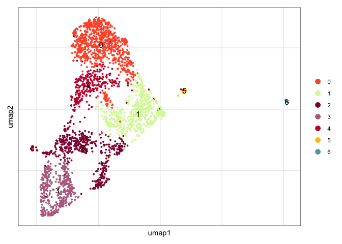<!-- -->

### location

``` r
DimPlot(seuratE18EYFPv2.int, reduction = "umap", group.by = "location", cols = collocation,
        shuffle = T) +
  theme_bw() +
  theme(axis.text = element_blank(), axis.ticks = element_blank(), 
        panel.grid.minor = element_blank()) +
  xlab("umap1") +
  ylab("umap2")
```

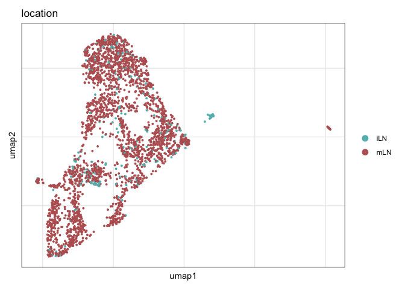<!-- -->

### label

``` r
colLab <- c("#900C3F","#b66e8d", "#003C67FF",
            "#e3953d", "#714542", "#b6856e","grey")
names(colLab) <- c("mLTo1", "mLTo2", "mLTo3", "mLTo4", "Adipoc", "Mesothelial", "Prolif")

DimPlot(seuratE18EYFPv2.int, reduction = "umap", group.by = "label", cols = colLab)+
  theme_bw() +
  theme(axis.text = element_blank(), axis.ticks = element_blank(), 
        panel.grid.minor = element_blank()) +
  xlab("UMAP1") +
  ylab("UMAP2")
```

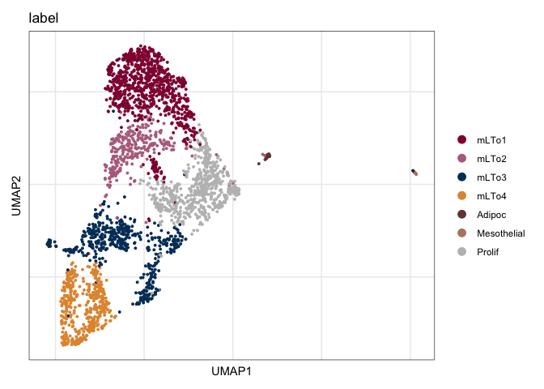<!-- -->

``` r
DimPlot(seuratE18EYFPv2.int, reduction = "umap", group.by = "label", pt.size=0.5,
        cols = colLab, shuffle = T)+
  theme_void()
```

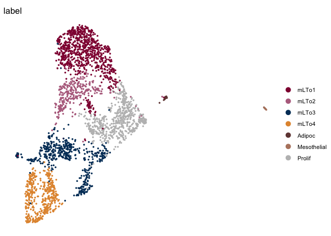<!-- -->

``` r
DimPlot(seuratE18EYFPv2.int, reduction = "umap", group.by = "label", pt.size=0.5,
        cols = colLab, shuffle = T)+
  theme_void() + 
  theme(legend.position = "none") 
```

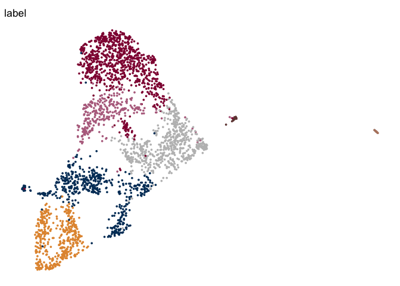<!-- -->

### calculate marker genes label

``` r
## calculate marker genes
Idents(seuratE18EYFPv2.int) <- seuratE18EYFPv2.int$label
levels(seuratE18EYFPv2.int)

markerGenes <- FindAllMarkers(seuratE18EYFPv2.int, only.pos=T) %>% 
  dplyr::filter(p_val_adj < 0.01) 
```


## dotplot FRC marker int v2

``` r
seurat_markers <- data.frame(gene=c("Vcam1", "Icam1",
                                    "Cxcl13", "Ccl19", "Ccl21a","Tnfsf11", "Grem1","Ifitm1","Cxcl1","Ifitm3","Ccl2","Nfkbia","Des",
                                    "Mfap5","Cdkn1c","Akap12","Anxa2","Lox","Gsn","Basp1","Fndc1","Sparc","Col1a1","Fbn2","Nr4a1","Fbln1","Cd34","Pi16",
                                    "Fbln5","Tm4sf1", "Ntrk3", "Fhl1", "Rgs7bp", "Adamts2", "Mpped2", "Ramp1", "Pdgfrl", "Eln", "Hspb2","Mgp", "Actg2","Acta2", "Myh11", "Mcam", 
                                    "Adipoq", "Mki67", "Msln"))

genes <- data.frame(geneID=rownames(seuratE18EYFPv2.int)) %>%
  mutate(gene=gsub(".*\\.", "",  geneID)) 

markerAll <- seurat_markers %>% left_join(., genes, by="gene")


## Dotplot all
Idents(seuratE18EYFPv2.int) <- seuratE18EYFPv2.int$label

DotPlot(seuratE18EYFPv2.int, assay="RNA", features = rev(markerAll$geneID), scale =T,
        cluster.idents = F) +
  scale_color_viridis_c() +
  coord_flip() +
  theme(axis.text.x = element_text(angle = 90, hjust = 1)) +
  scale_x_discrete(breaks=rev(markerAll$geneID), labels=rev(markerAll$gene)) +
  xlab("") + ylab("")
```

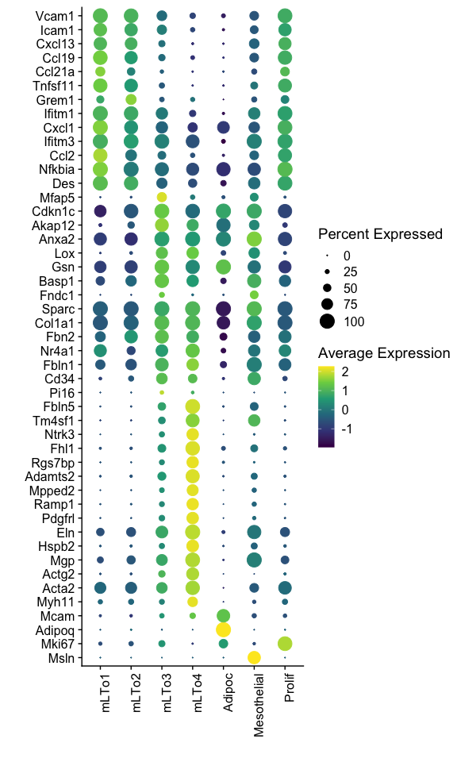<!-- -->
## mLTo signatures
### convert to sce 

``` r
##convert seurat object to sce object
DefaultAssay(object = seuratE18EYFPv2.int) <- "integrated"
sce <- as.SingleCellExperiment(seuratE18EYFPv2.int)
genes <- data.frame(geneID=rownames(sce)) %>% mutate(gene=gsub(".*\\.", "", geneID))
pal = colorRampPalette(c("#053061", "#2166ac", "#f7f7f7", "#f4a582", "#b2183c", "#85122d"))
```

### plot signature mLTo1/2

``` r
selGenes <- data.frame(gene=c("Cxcl13", "Ccl19", "Ccl21a","Tnfsf11", "Grem1"))
signGenes <- genes %>% dplyr::filter(gene %in% selGenes$gene)

##make a count matrix of signature genes
sceSub <- sce[which(rownames(sce) %in% signGenes$geneID),]
cntMat <- rowSums(t(as.matrix(
    sceSub@assays@data$logcounts)))/nrow(signGenes)
sceSub$sign <- cntMat
sceSub$sign2 <- sceSub$sign
sc <- scale_colour_gradientn(colours = pal(100), limits=c(0, 3))
sceSub$sign2[which(sceSub$sign > 3)] <- 3
##check max and min values
max(sceSub$sign)
```

```
## [1] 2.890401
```

``` r
plotUMAP(sceSub, colour_by = "sign2", point_size = 1) + sc +
  theme(legend.position = "none")
```

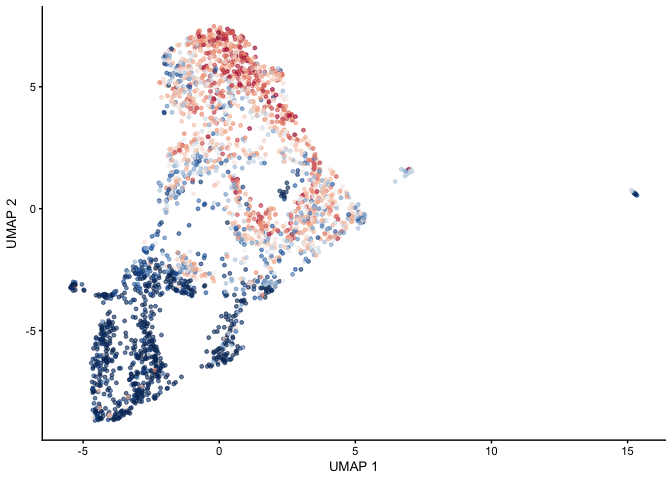<!-- -->

``` r
plotUMAP(sceSub, colour_by = "sign2", point_size = 1) + sc
```

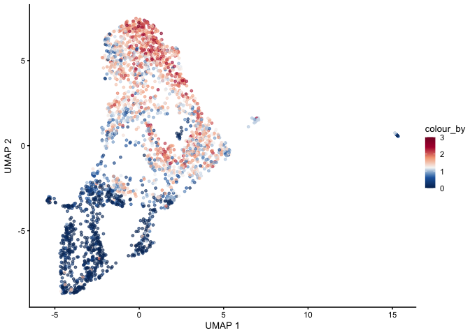<!-- -->

### plot signature mLTo3

``` r
selGenes <- data.frame(gene=c("Mfap5","Gsn","Fndc1","Col1a1","Cd34"))
signGenes <- genes %>% dplyr::filter(gene %in% selGenes$gene)

##make a count matrix of signature genes
sceSub <- sce[which(rownames(sce) %in% signGenes$geneID),]
cntMat <- rowSums(t(as.matrix(
    sceSub@assays@data$logcounts)))/nrow(signGenes)
sceSub$sign <- cntMat
sceSub$sign2 <- sceSub$sign
sc <- scale_colour_gradientn(colours = pal(100), limits=c(0, 3))
sceSub$sign2[which(sceSub$sign > 3)] <- 3
##check max and min values
max(sceSub$sign)
```

```
## [1] 2.652889
```

``` r
plotUMAP(sceSub, colour_by = "sign2", point_size = 1) + sc +
  theme(legend.position = "none")
```

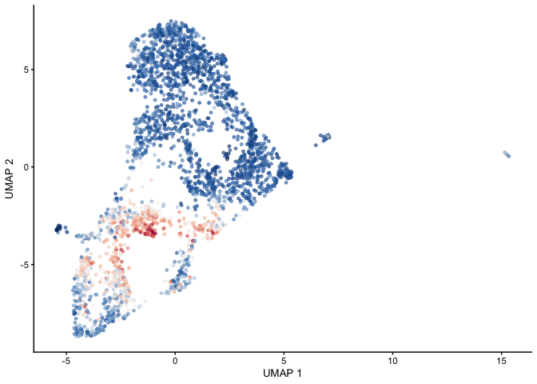<!-- -->

``` r
plotUMAP(sceSub, colour_by = "sign2", point_size = 1) + sc
```

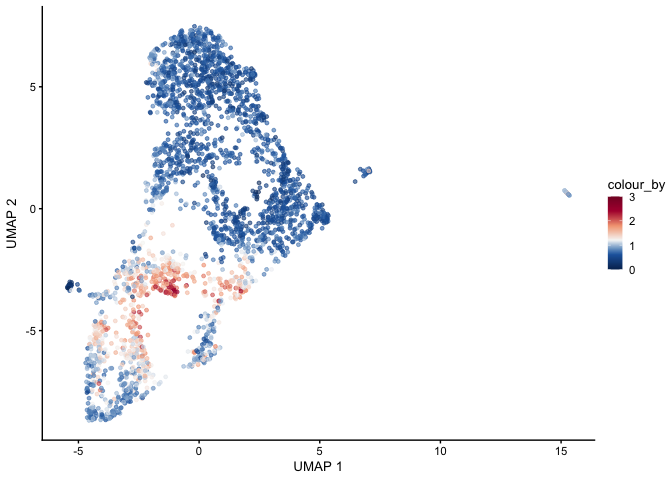<!-- -->

### plot signature mLTo4

``` r
selGenes <- data.frame(gene=c("Fbln5","Eln","Actg2","Acta2","Myh11"))
signGenes <- genes %>% dplyr::filter(gene %in% selGenes$gene)

##make a count matrix of signature genes
sceSub <- sce[which(rownames(sce) %in% signGenes$geneID),]
cntMat <- rowSums(t(as.matrix(
    sceSub@assays@data$logcounts)))/nrow(signGenes)
sceSub$sign <- cntMat
sceSub$sign2 <- sceSub$sign
sc <- scale_colour_gradientn(colours = pal(100), limits=c(0, 3))
sceSub$sign2[which(sceSub$sign > 3)] <- 3
##check max and min values
max(sceSub$sign)
```

```
## [1] 3.928997
```

``` r
plotUMAP(sceSub, colour_by = "sign2", point_size = 1) + sc +
  theme(legend.position = "none")
```

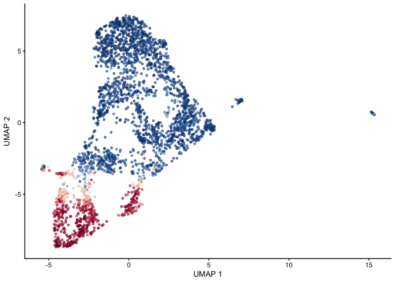<!-- -->

``` r
plotUMAP(sceSub, colour_by = "sign2", point_size = 1) + sc
```

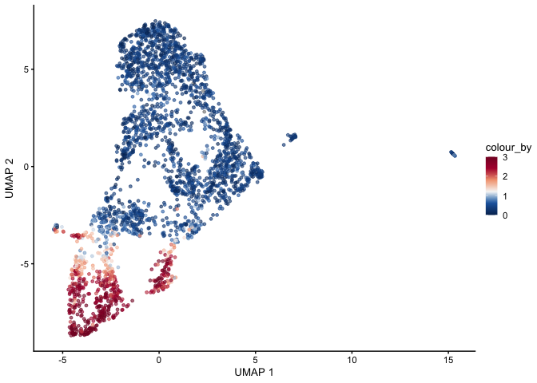<!-- -->

## session info

``` r
date()
```

```
## [1] "Mon May 26 15:11:06 2025"
```

``` r
sessionInfo()
```

```
## R version 4.4.0 (2024-04-24)
## Platform: x86_64-apple-darwin20
## Running under: macOS Ventura 13.7.5
## 
## Matrix products: default
## BLAS:   /Library/Frameworks/R.framework/Versions/4.4-x86_64/Resources/lib/libRblas.0.dylib 
## LAPACK: /Library/Frameworks/R.framework/Versions/4.4-x86_64/Resources/lib/libRlapack.dylib;  LAPACK version 3.12.0
## 
## locale:
## [1] en_US.UTF-8/en_US.UTF-8/en_US.UTF-8/C/en_US.UTF-8/en_US.UTF-8
## 
## time zone: Europe/Zurich
## tzcode source: internal
## 
## attached base packages:
## [1] grid      stats4    stats     graphics  grDevices utils     datasets  methods   base     
## 
## other attached packages:
##  [1] NCmisc_1.2.0                VennDiagram_1.7.3           futile.logger_1.4.3        
##  [4] ggupset_0.4.1               gridExtra_2.3               DOSE_3.30.5                
##  [7] enrichplot_1.24.4           msigdbr_10.0.2              org.Mm.eg.db_3.19.1        
## [10] AnnotationDbi_1.66.0        clusterProfiler_4.12.6      multtest_2.60.0            
## [13] metap_1.12                  scater_1.32.1               scuttle_1.14.0             
## [16] destiny_3.18.0              circlize_0.4.16             muscat_1.18.0              
## [19] viridis_0.6.5               viridisLite_0.4.2           lubridate_1.9.4            
## [22] forcats_1.0.0               stringr_1.5.1               purrr_1.0.4                
## [25] readr_2.1.5                 tidyr_1.3.1                 tibble_3.2.1               
## [28] tidyverse_2.0.0             dplyr_1.1.4                 SingleCellExperiment_1.26.0
## [31] SummarizedExperiment_1.34.0 Biobase_2.64.0              GenomicRanges_1.56.2       
## [34] GenomeInfoDb_1.40.1         IRanges_2.38.1              S4Vectors_0.42.1           
## [37] BiocGenerics_0.50.0         MatrixGenerics_1.16.0       matrixStats_1.5.0          
## [40] pheatmap_1.0.12             ggpubr_0.6.0                ggplot2_3.5.2              
## [43] Seurat_5.3.0                SeuratObject_5.1.0          sp_2.2-0                   
## [46] runSeurat3_0.1.0            ExploreSCdataSeurat3_0.1.0  workflowr_1.7.1            
## 
## loaded via a namespace (and not attached):
##   [1] igraph_2.1.4              ica_1.0-3                 plotly_4.10.4            
##   [4] Formula_1.2-5             zlibbioc_1.50.0           tidyselect_1.2.1         
##   [7] bit_4.6.0                 doParallel_1.0.17         clue_0.3-66              
##  [10] lattice_0.22-7            rjson_0.2.23              blob_1.2.4               
##  [13] S4Arrays_1.4.1            pbkrtest_0.5.4            parallel_4.4.0           
##  [16] png_0.1-8                 plotrix_3.8-4             ggplotify_0.1.2          
##  [19] cli_3.6.5                 goftest_1.2-3             VIM_6.2.2                
##  [22] variancePartition_1.34.0  BiocNeighbors_1.22.0      shadowtext_0.1.4         
##  [25] uwot_0.2.3                curl_6.2.2                tidytree_0.4.6           
##  [28] mime_0.13                 evaluate_1.0.3            ComplexHeatmap_2.20.0    
##  [31] stringi_1.8.7             backports_1.5.0           lmerTest_3.1-3           
##  [34] qqconf_1.3.2              httpuv_1.6.16             magrittr_2.0.3           
##  [37] rappdirs_0.3.3            splines_4.4.0             ggraph_2.2.1             
##  [40] sctransform_0.4.2         ggbeeswarm_0.7.2          DBI_1.2.3                
##  [43] jquerylib_0.1.4           smoother_1.3              withr_3.0.2              
##  [46] git2r_0.36.2              corpcor_1.6.10            reformulas_0.4.1         
##  [49] class_7.3-23              rprojroot_2.0.4           lmtest_0.9-40            
##  [52] tidygraph_1.3.1           formatR_1.14              colourpicker_1.3.0       
##  [55] htmlwidgets_1.6.4         fs_1.6.6                  ggrepel_0.9.6            
##  [58] labeling_0.4.3            fANCOVA_0.6-1             SparseArray_1.4.8        
##  [61] DESeq2_1.44.0             ranger_0.17.0             DEoptimR_1.1-3-1         
##  [64] reticulate_1.42.0         hexbin_1.28.5             zoo_1.8-14               
##  [67] XVector_0.44.0            knitr_1.50                ggplot.multistats_1.0.1  
##  [70] UCSC.utils_1.0.0          RhpcBLASctl_0.23-42       timechange_0.3.0         
##  [73] foreach_1.5.2             patchwork_1.3.0           caTools_1.18.3           
##  [76] ggtree_3.12.0             data.table_1.17.2         R.oo_1.27.1              
##  [79] RSpectra_0.16-2           irlba_2.3.5.1             gridGraphics_0.5-1       
##  [82] fastDummies_1.7.5         lazyeval_0.2.2            yaml_2.3.10              
##  [85] survival_3.8-3            scattermore_1.2           crayon_1.5.3             
##  [88] RcppAnnoy_0.0.22          RColorBrewer_1.1-3        progressr_0.15.1         
##  [91] tweenr_2.0.3              later_1.4.2               ggridges_0.5.6           
##  [94] codetools_0.2-20          GlobalOptions_0.1.2       aod_1.3.3                
##  [97] KEGGREST_1.44.1           Rtsne_0.17                shape_1.4.6.1            
## [100] limma_3.60.6              pkgconfig_2.0.3           TMB_1.9.17               
## [103] spatstat.univar_3.1-3     mathjaxr_1.8-0            EnvStats_3.1.0           
## [106] getPass_0.2-4             aplot_0.2.5               scatterplot3d_0.3-44     
## [109] ape_5.8-1                 spatstat.sparse_3.1-0     xtable_1.8-4             
## [112] car_3.1-3                 plyr_1.8.9                httr_1.4.7               
## [115] rbibutils_2.3             tools_4.4.0               globals_0.18.0           
## [118] beeswarm_0.4.0            broom_1.0.8               nlme_3.1-168             
## [121] lambda.r_1.2.4            assertthat_0.2.1          lme4_1.1-37              
## [124] digest_0.6.37             numDeriv_2016.8-1.1       Matrix_1.7-3             
## [127] farver_2.1.2              tzdb_0.5.0                remaCor_0.0.18           
## [130] reshape2_1.4.4            yulab.utils_0.2.0         glue_1.8.0               
## [133] cachem_1.1.0              polyclip_1.10-7           generics_0.1.4           
## [136] Biostrings_2.72.1         mvtnorm_1.3-3             parallelly_1.44.0        
## [139] mnormt_2.1.1              statmod_1.5.0             RcppHNSW_0.6.0           
## [142] ScaledMatrix_1.12.0       carData_3.0-5             minqa_1.2.8              
## [145] pbapply_1.7-2             httr2_1.1.2               spam_2.11-1              
## [148] gson_0.1.0                graphlayouts_1.2.2        gtools_3.9.5             
## [151] ggsignif_0.6.4            RcppEigen_0.3.4.0.2       shiny_1.10.0             
## [154] GenomeInfoDbData_1.2.12   glmmTMB_1.1.11            R.utils_2.13.0           
## [157] memoise_2.0.1             rmarkdown_2.29            scales_1.4.0             
## [160] R.methodsS3_1.8.2         future_1.49.0             RANN_2.6.2               
## [163] Cairo_1.6-2               spatstat.data_3.1-6       rstudioapi_0.17.1        
## [166] cluster_2.1.8.1           whisker_0.4.1             mutoss_0.1-13            
## [169] spatstat.utils_3.1-3      hms_1.1.3                 fitdistrplus_1.2-2       
## [172] cowplot_1.1.3             colorspace_2.1-1          rlang_1.1.6              
## [175] DelayedMatrixStats_1.26.0 sparseMatrixStats_1.16.0  xts_0.14.1               
## [178] dotCall64_1.2             shinydashboard_0.7.3      ggforce_0.4.2            
## [181] laeken_0.5.3              mgcv_1.9-3                xfun_0.52                
## [184] e1071_1.7-16              TH.data_1.1-3             iterators_1.0.14         
## [187] abind_1.4-8               GOSemSim_2.30.2           treeio_1.28.0            
## [190] futile.options_1.0.1      bitops_1.0-9              Rdpack_2.6.4             
## [193] ps_1.9.1                  promises_1.3.2            scatterpie_0.2.4         
## [196] RSQLite_2.3.11            qvalue_2.36.0             sandwich_3.1-1           
## [199] fgsea_1.30.0              DelayedArray_0.30.1       proxy_0.4-27             
## [202] GO.db_3.19.1              compiler_4.4.0            prettyunits_1.2.0        
## [205] boot_1.3-31               beachmat_2.20.0           listenv_0.9.1            
## [208] Rcpp_1.0.14               edgeR_4.2.2               BiocSingular_1.20.0      
## [211] tensor_1.5                MASS_7.3-65               progress_1.2.3           
## [214] BiocParallel_1.38.0       babelgene_22.9            spatstat.random_3.3-3    
## [217] R6_2.6.1                  fastmap_1.2.0             multcomp_1.4-28          
## [220] fastmatch_1.1-6           rstatix_0.7.2             vipor_0.4.7              
## [223] TTR_0.24.4                ROCR_1.0-11               TFisher_0.2.0            
## [226] rsvd_1.0.5                vcd_1.4-13                nnet_7.3-20              
## [229] gtable_0.3.6              KernSmooth_2.23-26        miniUI_0.1.2             
## [232] deldir_2.0-4              htmltools_0.5.8.1         ggthemes_5.1.0           
## [235] bit64_4.6.0-1             spatstat.explore_3.4-2    lifecycle_1.0.4          
## [238] blme_1.0-6                msigdbdf_24.1.1           processx_3.8.6           
## [241] nloptr_2.2.1              callr_3.7.6               sass_0.4.10              
## [244] vctrs_0.6.5               robustbase_0.99-4-1       spatstat.geom_3.3-6      
## [247] ggfun_0.1.8               sn_2.1.1                  future.apply_1.11.3      
## [250] bslib_0.9.0               pillar_1.10.2             gplots_3.2.0             
## [253] pcaMethods_1.96.0         locfit_1.5-9.12           jsonlite_2.0.0           
## [256] GetoptLong_1.0.5
```
